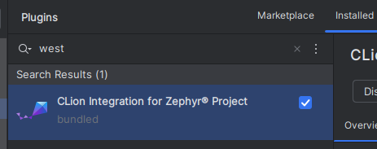
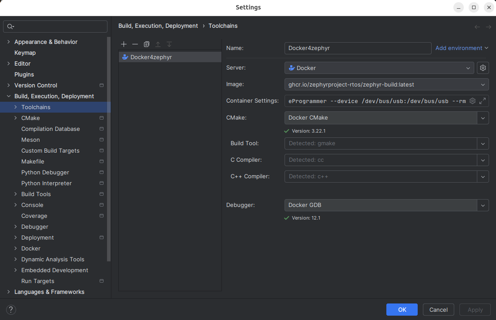
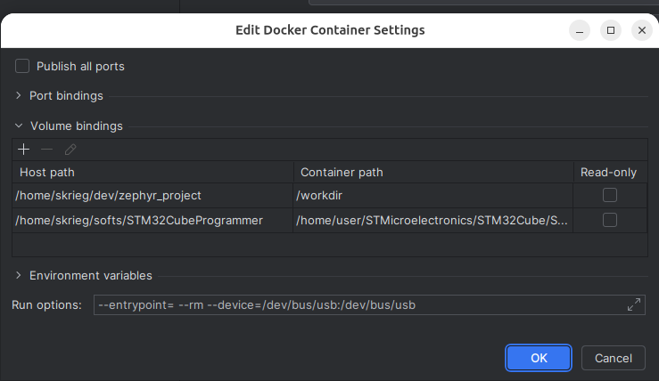
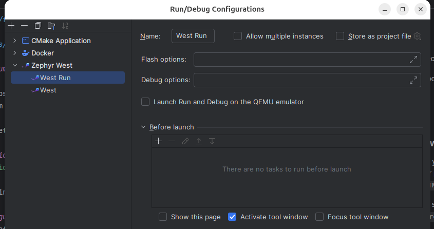

This tutorial explains how to configure CLion to use a dockerized zephyr and how to configure the toolchain to flash a stm32 device.
Ubuntu host.


# Zephyr docker image
The docker container is managed by CLion. But you need to pull it before.

```
docker pull ghcr.io/zephyrproject-rtos/zephyr-build:main
```

# STM32CubeProgrammer
Download the STM32 Cube Programmer CLI from stm website.

[STM download website](https://www.st.com/en/development-tools/stm32cubeprog.html)

Install it where you want. STM32_Programmer_CLI is located here ```STM32CubeProgrammer/bin/STM32_Programmer_CLI```

# West project

This section must be completed.

The project will be mounted in the directory "/workdir" of the docker.


# CLion Configuration

## West plugin
West plugin must be installed in CLion.




## Toolchain
In settings Build, Execution, Deployment > Toolchains. Add a docker toolchain.

**IMPORTANT**: This toolchain must be the default toolchain. West plugin will take the first toolchain of the list.





### Configure the two volumes to bind from the host to the docker

- The project from your host project directory to /workdir
- The programmer path from your host programmer directory to *  ```/home/user/STMicroelectronics/STM32Cube/STM32CubeProgrammer```

*I didn't find a way to set another directory than, ```/home/user/STMicroelectronics/STM32Cube/STM32CubeProgrammer```. 

### Configure the run options
>--entrypoint= --rm --device=/dev/bus/usb:/dev/bus/usb

The device option is required to allow the docker to access the usb port of the host.

### Add a run/debug configuration
In CLion, edit the run configurations (top right of the screen). Add a new configuration with +, select Zephyr-west is the list.



It will create a west run config, there is nothing else to add here.

# Linux host usb permissions

### 1. Add new udev rules file for stlink
Create the file:

```sudo nano /etc/udev/rules.d/99-stlink-v3.rules```

Add rules to the file:

```SUBSYSTEM=="usb", ATTRS{idVendor}=="0483", ATTRS{idProduct}=="374e", MODE="0666", GROUP="dialout"```

### 2. Add your user to the dialout group
```sudo usermod -a -G dialout $USER```

### 3. Update the rules
First disconnect your board from usb.
```
sudo udevadm control --reload-rules
sudo udevadm trigger
```


