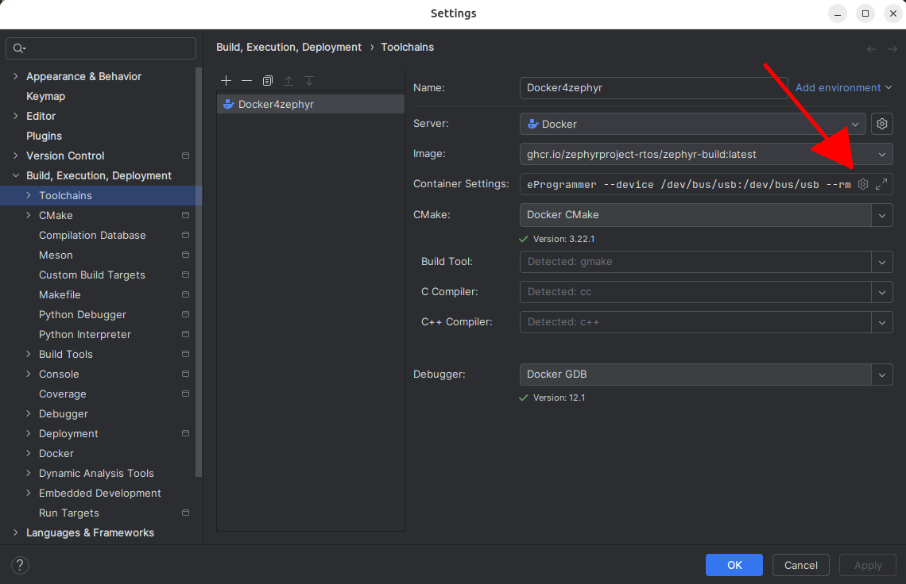

This tutorial explains how to configure CLion to use a dockerized zephyr and how to configure the toolchain to flash a stm32 device.
Ubuntu host.


# Zephyr docker image
The docker container is managed by CLion. But you need to pull it before.

```
docker pull ghcr.io/zephyrproject-rtos/zephyr-build:main
```

# West project

....

The project will be mounted in the directory "/workdir" of the docker.

# CLion Configuration

## West plugin
West plugin must be installed in CLion.


## Toolchain
In settings Build, Execution, Deployment > Toolchains. Add a docker toolchain.

**IMPORTANT**: This toolchain must be the default toolchain. West plugin will take the first toolchain of the list.




### Configure the two volumes to bind from the host to the docker

- The project from your host project directory to /workdir
- The programmer path from your host programmer directory to *  ```/home/user/STMicroelectronics/STM32Cube/STM32CubeProgrammer```

*I didn't find a way to set another directory than, ```/home/user/STMicroelectronics/STM32Cube/STM32CubeProgrammer```. 

### Configure the run options
>--entrypoint= --rm --device=/dev/bus/usb:/dev/bus/usb

The device option is required to allow the docker to access the usb port of the host.

### Add a run/debug configuration
In CLion, edit the run configurations (top right of the screen). Add a new configuration with +, select Zephyr-west is the list.


It will create a west run config, there is nothing else to add here.

# Linux host usb permissions
    